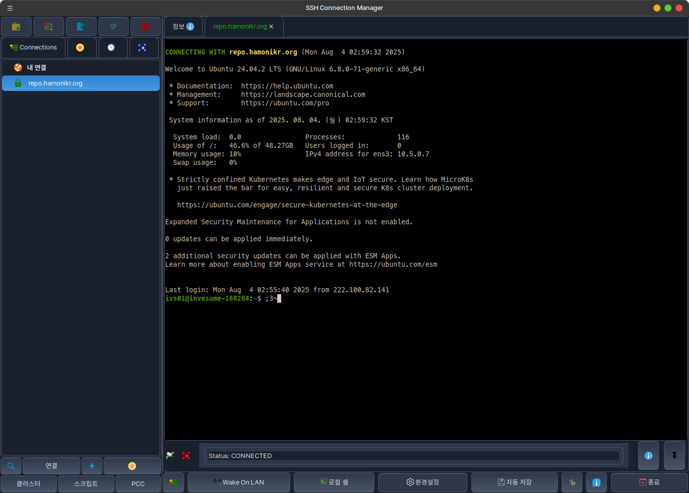
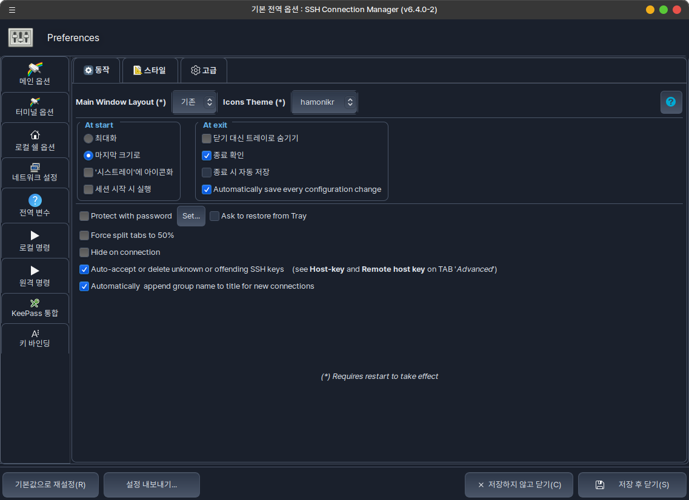

# HamoniKR SSH Client



**HamoniKR SSH Client**는 원격 터미널 세션을 체계적으로 관리하고 반복 작업을 자동화하는 데 도움이 되는 무료 오픈소스 연결 관리자입니다.

* Upstream: [Ásbrú Connection Manager](https://github.com/asbru-cm/asbru-cm) 기반
* License: GPL-3.0
* Homepage: [https://hamonikr.org](https://hamonikr.org)



## 주요 기능

### 연결 관리
- **다양한 프로토콜 지원**: SSH, Telnet, FTP, SFTP, RDP, VNC, Mosh 등
- **간단한 GUI**: 원격 머신으로의 연결 관리 및 실행을 위한 직관적인 인터페이스
- **프록시 서버 지원**: 프록시 서버를 통한 연결 기능
- **클러스터 연결**: 여러 서버에 동시 연결 및 관리
- **탭/창 터미널**: 탭 또는 별도 창으로 터미널 세션 관리

### 자동화 및 스크립팅
- **스크립팅 기능**: SecureCRT와 유사한 스크립팅 가능
- **사전/사후 명령 실행**: 연결 전후 로컬 명령 실행 설정
- **매크로 지원**: 연결 시 실행할 명령 목록 설정
- **Expect 조건부 실행**: 연결된 머신에서 조건부 명령 실행
  - SSH 인증서 자동 처리
  - 다중 SSH 연결 체인
  - 터널 자동 생성
  - 라인 전송 지연 기능

### 보안 및 인증
- **KeePassXC 통합**: KeePass 데이터베이스 파일(.kdbx) 연동
- **다양한 인증 방식**: 비밀번호, 개인키, 공개키 인증 지원
- **전역/로컬 변수**: 비밀번호 중앙 관리 및 연결 문자열 재사용

### 사용자 인터페이스
- **Gnome/GTK 통합**: 원활한 데스크톱 환경 통합
- **시스템 트레이**: 우클릭으로 빠른 연결 실행
- **테마 지원**: 다양한 테마 선택 (기본, 다크, HamoniKR 테마 등)
- **다국어 지원**: 한국어 포함 다국어 인터페이스

### 추가 기능
- **Wake On LAN**: 원격 머신 원격 깨우기
- **연결 통계**: 연결 사용량 통계 및 스크린샷
- **검색 기능**: 연결 목록에서 빠른 검색
- **백업/복원**: 설정 백업 및 복원 기능

## 설치 방법

### HamoniKR / Debian / Ubuntu

```bash
# HamoniKR APT 저장소 추가
wget -qO- https://repo.hamonikr.org/hamonikr.apt | sudo -E bash -

# 프로그램 설치
sudo apt install -y hamonikr-ssh
```
## 소스에서 설치

### 의존성 설치

#### Debian/Ubuntu
```bash
sudo apt-get update
sudo apt-get install -y \
    perl libvte-2.91-0 libcairo-perl libglib-perl libpango-perl \
    libsocket6-perl libexpect-perl libyaml-perl libcrypt-cbc-perl \
    libcrypt-blowfish-perl libgtk3-perl libnet-arp-perl libossp-uuid-perl \
    openssh-client libcrypt-rijndael-perl libxml-parser-perl \
    libcanberra-gtk-module dbus-x11 libgtk3-simplelist-perl \
    gir1.2-wnck-3.0 gir1.2-vte-2.91 ncat gettext debhelper
```

#### 권장 패키지
```bash
sudo apt-get install -y keepassxc telnet ftp freerdp-x11 tigervnc-viewer mosh
```

### 소스 코드 다운로드 및 빌드

```bash
# 소스 코드 클론
git clone https://github.com/hamonikr/hamonikr-ssh.git
cd hamonikr-ssh

# 번역 파일 빌드 (선택사항)
cd po
make all
cd ..

# 직접 실행
./asbru-cm

# 또는 데비안 패키지 빌드
./build-for-hamonikr.sh
```

### Docker를 이용한 빌드

```bash
# Docker 빌드 스크립트 실행
./build-with-docker.sh
```

## 번역 추가하기

HamoniKR SSH Client는 GNU gettext를 사용하여 다국어를 지원합니다.

### 새로운 언어 추가

1. **번역 템플릿 생성**:
```bash
cd po
make extract-pot
```

2. **새 언어 파일 생성** (예: 일본어):
```bash
msginit -l ja_JP.UTF-8 -o ja.po -i asbru-cm.pot --no-translator
```

3. **번역 파일 편집**:
```bash
# ja.po 파일을 편집하여 번역 추가
nano ja.po
```

번역 예시:
```po
#: ../lib/PACConfig.pm:130
msgid "Default Global Options"
msgstr "デフォルトのグローバルオプション"
```

4. **Makefile 업데이트**:
```makefile
LANGUAGES = ko ja
POFILES = ko.po ja.po
```

5. **번역 파일 컴파일**:
```bash
make all
```

6. **설치 및 테스트**:
```bash
make install
LANG=ja_JP.UTF-8 ../asbru-cm
```

### 기존 번역 업데이트

```bash
cd po
make update-po  # 새로운 문자열을 기존 번역에 병합
# ko.po 파일 편집
make all        # 컴파일
```

## 테마 추가하기

### 기존 테마
- `default`: 기본 테마
- `system`: 시스템 테마
- `asbru-color`: Ásbrú 컬러 테마
- `asbru-dark`: Ásbrú 다크 테마  
- `hamonikr`: HamoniKR 전용 테마

### 새 테마 만들기

1. **테마 디렉토리 생성**:
```bash
mkdir -p res/themes/my-theme
```

2. **CSS 파일 생성**:
```bash
cp res/themes/default/asbru.css res/themes/my-theme/asbru.css
```

3. **아이콘 복사** (선택사항):
```bash
cp res/themes/default/*.png res/themes/my-theme/
cp res/themes/default/*.svg res/themes/my-theme/
```

4. **CSS 스타일 편집**:
```css
/* res/themes/my-theme/asbru.css */
button {
    background: linear-gradient(to bottom, #your-color1, #your-color2);
    color: #text-color;
    border: 1px solid #border-color;
    border-radius: 6px;
}

window {
    background-color: #background-color;
    color: #text-color;
}
```

5. **테마 활성화**:
- 애플리케이션 실행 후 `환경설정` → `스타일` → `테마`에서 새 테마 선택

### 테마 개발 팁

- **GTK3 CSS 참조**: [GTK3 CSS 문서](https://docs.gtk.org/gtk3/css-overview.html)
- **기존 테마 참고**: `res/themes/` 디렉토리의 다른 테마들 참조
- **실시간 테스트**: 애플리케이션을 재시작하여 변경사항 확인
- **CSS 선택자**: 주요 UI 요소들의 CSS 클래스 이름 확인

## 릴리즈 관리

프로젝트는 `dev` 브랜치에서 개발하고 `master` 브랜치에서 릴리즈를 관리합니다.

### 릴리즈 스크립트 사용법

```bash
# dev 브랜치에서 실행
cd /path/to/hamonikr-ssh

# Patch 버전 증가 (예: 6.4.0 -> 6.4.1)
./scripts/release.sh patch

# Minor 버전 증가 (예: 6.4.0 -> 6.5.0)
./scripts/release.sh minor

# Major 버전 증가 (예: 6.4.0 -> 7.0.0)
./scripts/release.sh major

# 자동 확인 없이 patch 버전 증가
./scripts/release.sh -y
./scripts/release.sh patch --yes
```

### 릴리즈 프로세스

릴리즈 스크립트는 다음 작업을 자동으로 수행합니다:

1. **사전 검사**:
   - dev 브랜치에서 실행 중인지 확인
   - 커밋되지 않은 변경사항 확인
   - master와 dev 브랜치 차이 확인

2. **버전 업데이트**:
   - `lib/PACUtils.pm`의 `APPVERSION` 업데이트
   - 버전 변경사항 커밋

3. **릴리즈 실행**:
   - master 브랜치로 전환 및 업데이트
   - dev 브랜치 머지
   - 새 버전 태그 생성
   - master 브랜치 및 태그 푸시

4. **정리**:
   - dev 브랜치로 복귀
   - master 변경사항 동기화

### 수동 릴리즈

자동 스크립트를 사용하지 않는 경우:

```bash
# 1. 버전 업데이트
vim lib/PACUtils.pm  # APPVERSION 수정

# 2. 변경사항 커밋
git add lib/PACUtils.pm
git commit -m "chore: bump version to v6.4.1"

# 3. master 브랜치로 머지
git checkout master
git pull origin master
git merge dev
git push origin master

# 4. 태그 생성 및 푸시
git tag -a v6.4.1 -m "Release v6.4.1"
git push origin v6.4.1

# 5. dev 브랜치 동기화
git checkout dev
git merge master
git push origin dev
```

## 기여하기

1. 이 저장소를 포크합니다
2. 기능 브랜치를 생성합니다 (`git checkout -b feature/amazing-feature`)
3. 변경사항을 커밋합니다 (`git commit -m 'Add some amazing feature'`)
4. 브랜치에 푸시합니다 (`git push origin feature/amazing-feature`)
5. Pull Request를 생성합니다

### 개발 워크플로

- **dev 브랜치**: 모든 개발 작업
- **master 브랜치**: 안정적인 릴리즈 버전
- **feature 브랜치**: 새로운 기능 개발
- **hotfix 브랜치**: 긴급 버그 수정

## 라이선스

이 프로젝트는 GPL-3.0 라이선스 하에 배포됩니다. 자세한 내용은 [LICENSE](LICENSE) 파일을 참조하세요.

## 지원

- **이슈 리포트**: [GitHub Issues](https://github.com/hamonikr/hamonikr-ssh/issues)
- **문서**: [프로젝트 문서](doc/)
- **커뮤니티**: [HamoniKR 커뮤니티](https://hamonikr.org)

## 관련 프로젝트

- **Upstream**: [Ásbrú Connection Manager](https://github.com/asbru-cm/asbru-cm)
- **HamoniKR OS**: [https://hamonikr.org](https://hamonikr.org)
